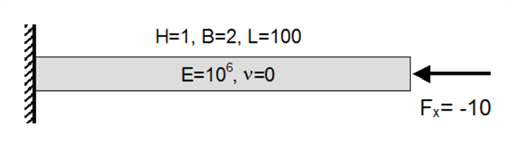
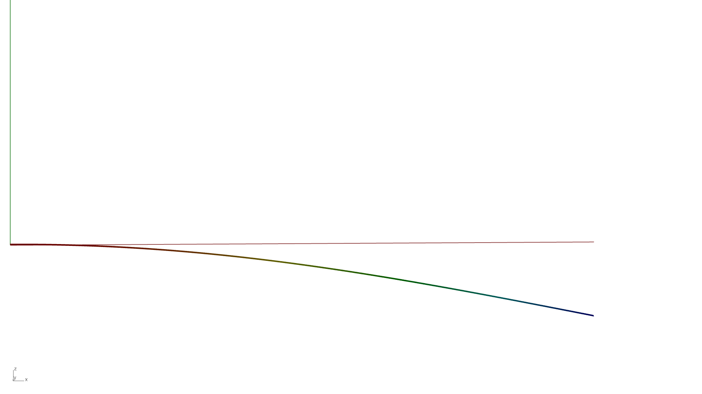
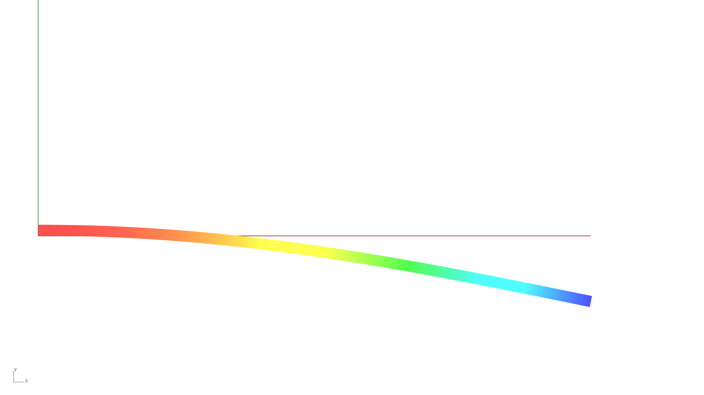
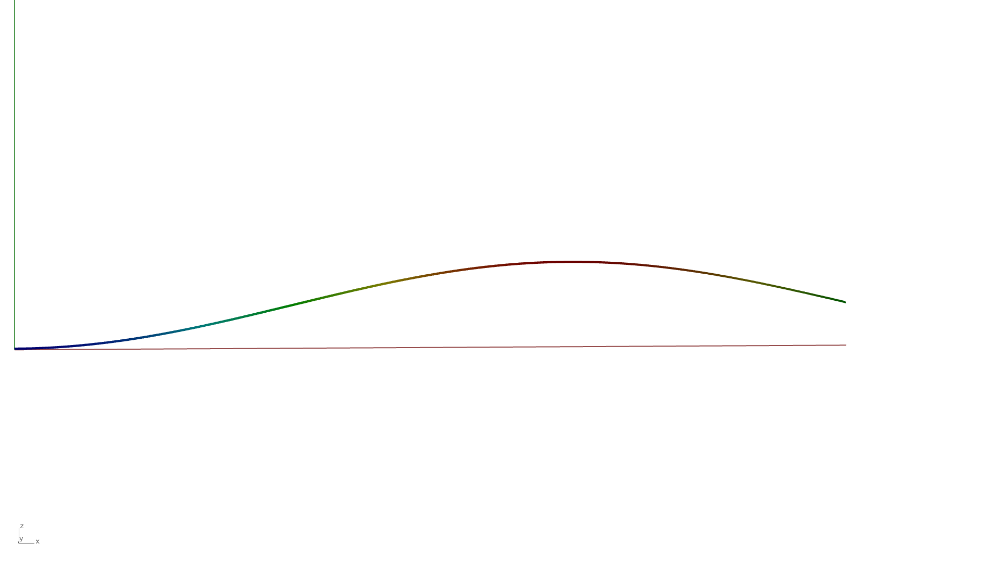
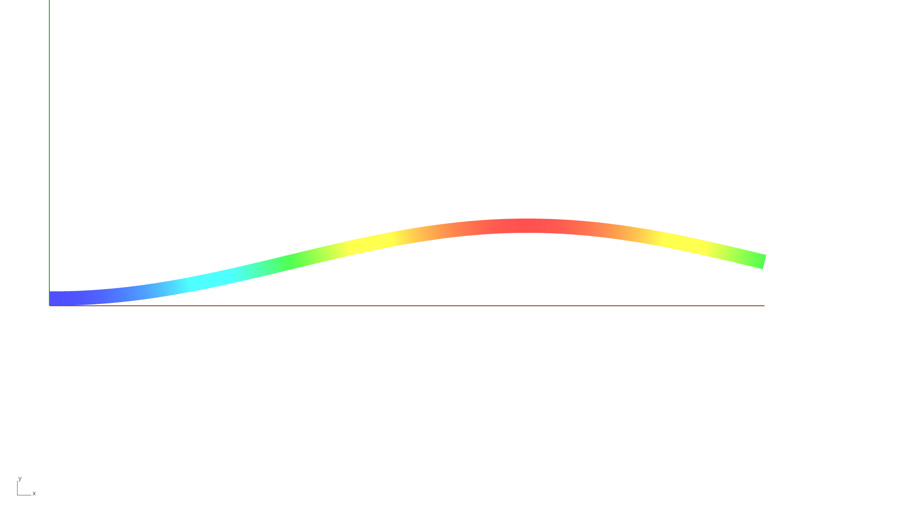

# Buckling Analysis - Single Patch - Cantilever Beam

**Author:** Aakash Ravichandran

**Kratos version:** 10.2

**Source files:** [Buckling Analysis - Single Patch - Cantilever Beam](https://github.com/KratosMultiphysics/Examples/tree/master/iga/validation/buckling_analysis_single_patch_cantilever_beam/source)

## Problem definition

This example presents the validation of buckling analysis in Kratos with Isogeometric Analysis.

*Structural System [1]*

The cantilever beam is modeled using single NURBS patch with the Shell3pElement. The CAD model is constructed with single span B-spline surfaces and has a curve degree of 2 in both directions of the plane. Additional refinement is applied in Kratos, by increasing the curve degree to 4 in both axes and inserting 4 knots in the width and 20 knots along the length of the beam.

## Results

The buckling load factors are shown in table below. The corresponding buckling modes are shown in image below.  

|  | Reference | Kratos |
| :--- | :--- | :--- |
| $\lambda_{cr}^{(1)}$ | 4.1123 | 4.06977 |
| $\lambda_{cr}^{(2)}$ | 16.449 | 16.1693 |
| $\lambda_{cr}^{(3)}$ | 37.011 | 36.6759 |
| $\lambda_{cr}^{(4)}$ | 102.81 | 102.106 |

| Buckling Mode Shape 1 | Buckling Mode Shape 2 |
| :---: | :---: |
|  |  |

| Buckling Mode Shape 3 | Buckling Mode Shape 4 |
| :---: | :---: |
|  |  |

## References

1. Altair Engineering, Inc. (2026). *OS-V: 0080 Buckling of Shells and Composites with Offset*. In Altair OptiStruct Verification Problems. [link](https://help.altair.com/hwsolvers/os/topics/solvers/os/buckling_of_shells_and_composites_with_offset_verification_r.htm)