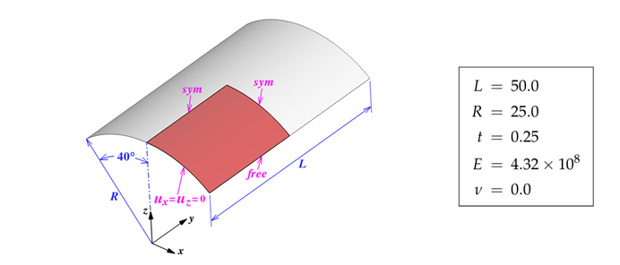
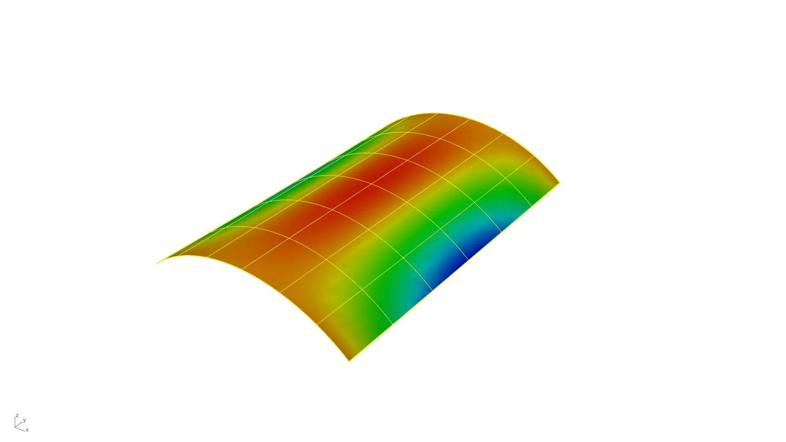

# Geometric Linear Analysis - Single Patch - Scordelis-Lo Roof

**Author:** Aakash Ravichandran

**Kratos version:** 10.4

**Source files:** [Geometric Linear Analysis - Single Patch - Scordelis-Lo Roof](https://github.com/KratosMultiphysics/Examples/tree/master/iga/validation/geometric_linear_analysis_single_patch_scordelis_lo_roof/source)

## Problem definition

This example presents the validation of Scordelis-Lo Roof with Shell3pElement in geometric linear analysis [1]. 

*Structural System [1]*

Load = 90 per unit

The roof is modeled using single NURBS patch with the Shell3pElement. The CAD model is constructed with single span b-splines of curve degree 2 in both axis of the roof. Additional refinement is applied in Kratos, by increasing the curve degree to 4 and inserting 6 knots in each direction of the roof. 

## Results

The displacement at mid of the free edge as -0.3068 units, which is in agreement with the reference value of -0.3024 units.

*Displacement Result*

## References

1. Josef M. Kiendl, *Isogeometric Analysis and Shape Optimal Design of Shell Structures*, PhD Dissertation, pp. 51–52. [Link](https://mediatum.ub.tum.de/doc/1002634/464162.pdf)