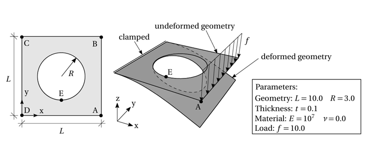
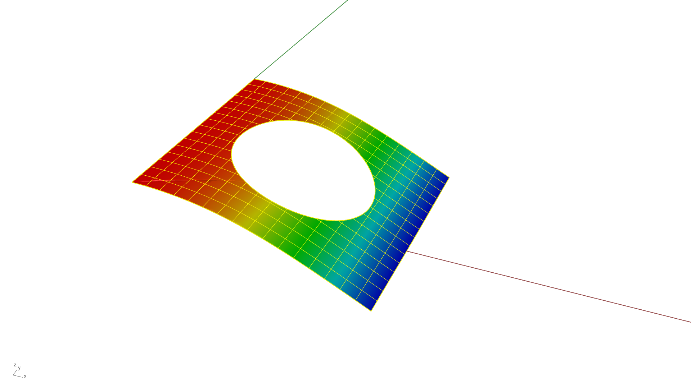

# Geometric Linear Analysis - Trimmed Patch - Plate with Hole

**Author:** Aakash Ravichandran

**Kratos version:** 10.4

**Source files:** [Geometric Linear Analysis - Trimmed Patch - Plate with Hole](https://github.com/KratosMultiphysics/Examples/tree/master/iga/validation/plate_with_hole_trimmed_patch_linear/source)

## Problem definition

This example presents the validation of geometric linear analysis for a square plate with a circular hole subjected to bending. 

*Structural System [1]*

The plate is modeled using single trimmed NURBS patch with the Shell3pElement. The CAD model is constructed with single span b-splines of curve degree 2 in both axis of the plate. Additional refinement is applied in Kratos, by increasing the curve degree to 4 and inserting 15 knots in each direction of the plate. 

## Results

The displacement at point A is obtained as -6.3511 units, which is in agreement with the reference value of -6.3499 units.

*Displacement Result*

## References

1. Michael Breitenberger, *CAD-Integrated Design and Analysis of Shell Structures*, PhD Dissertation, pp. 122–125. [Link](https://mediatum.ub.tum.de/doc/1311417/93268.pdf)