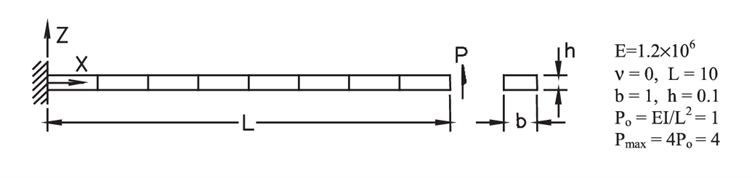
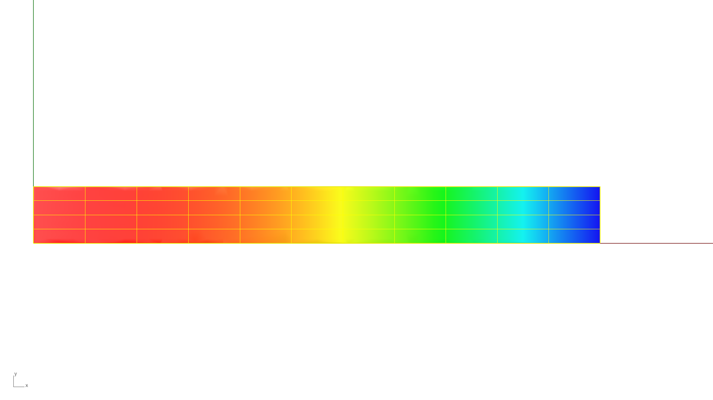

# Geometric Non-Linear Analysis - Single Patch - Cantilever Beam

**Author:** Aakash Ravichandran

**Kratos version:** 10.4

**Source files:** [Geometric Non-Linear Analysis - Single Patch - Cantilever Beam](https://github.com/KratosMultiphysics/Examples/tree/master/iga/validation/cantilever_beam_multi_patch_non_linear/source)

## Problem definition

This example presents the validation of geometric non-linear analysis of a cantilever beam subjected to a end shear force [1].

*Structural System [1]*

The cantilever beam is modeled using a single NURB patch with the Shell3pElement. The CAD model of the patch is constructed with single span B-spline surface. The patch has an curve degree of 3 in the longitudinal direction and 2 in the transverse direction. Additional refinement is applied in Kratos by increasing the curve degree by 1 in both directions for both patches. Furthermore, h-refinement is applied by inserting 10 knots longitudinally and 3 knots transversely in the patch. 

## Results

The load-displacement curve obtained at the free end is shown in [figure](data/LoadStep_vs_Displacement_XZ.png). This shows a good agreement with the reference [1] - Figure 2a and Table 2. 

*Displacement Result*

| Reference Force vs Displacement [1] | Force vs Displacement - From Kratos |
| :---: | :---: |
|  |  |

## References

1. Sze, K. Y., Liu, X. H., & Lo, S. H. (2004). Popular benchmark problems for geometric nonlinear analysis of shells. *Finite Elements in Analysis and Design*, 40(11), 1551–1569. https://doi.org/10.1016/j.finel.2003.11.001