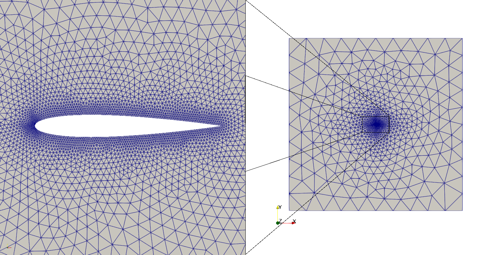
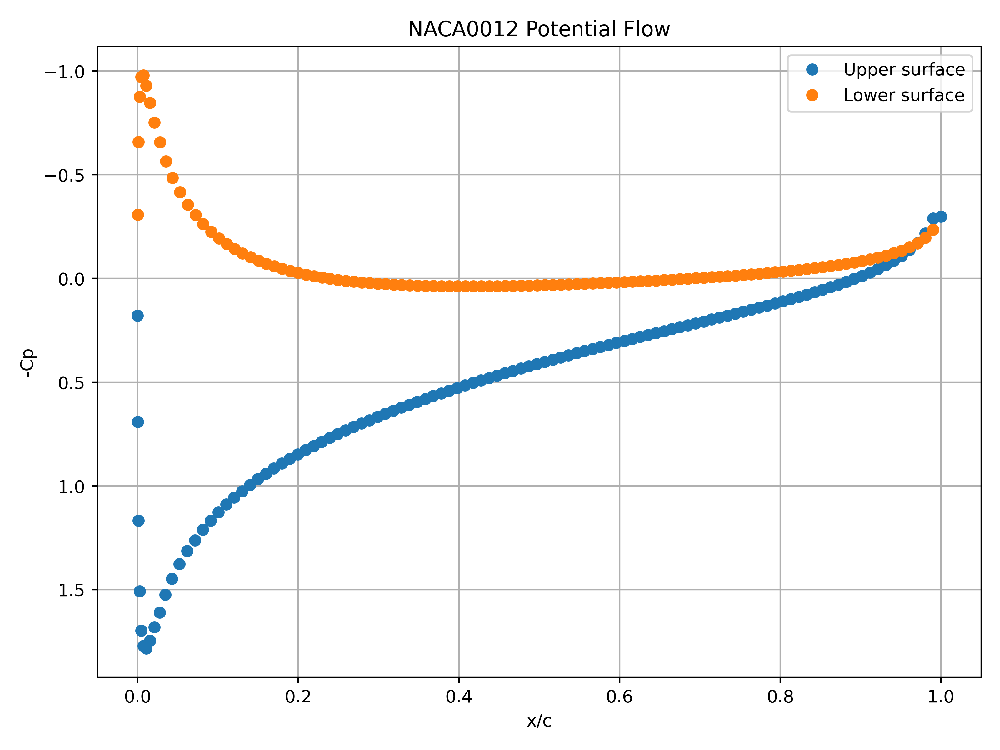
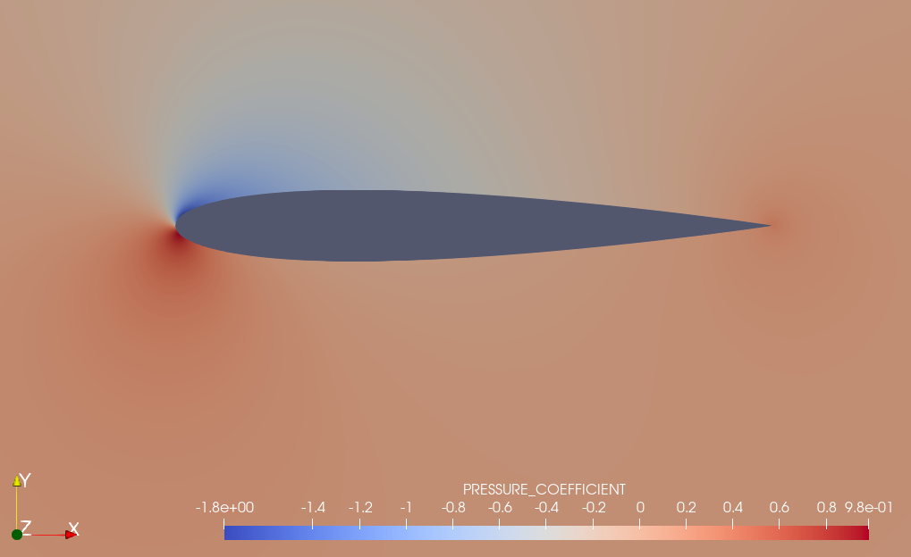
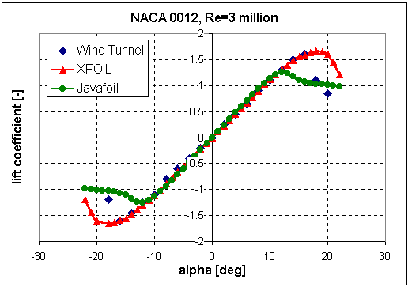

# Incompressible Potential Flow 
# Naca 0012 airfoil - Mach number = 0.0588, Angle of attack = 5º

**Author:** [Juan Ignacio Camarotti](https://github.com/juancamarotti)

**Kratos version:** 10.4

**Source files:** [Naca 0012 incompressible potential flow](https://github.com/KratosMultiphysics/Examples/tree/master/potential_flow/validation/naca0012_potential_incompressible_flow/source)

## Case Specification
This example presents a two-dimensional simulation of inviscid incompressible flow around a NACA 0012 airfoil using the potential flow solver available in the Kratos CompressiblePotentialFlowApplication.

The flow around the airfoil is computed at AOA=5° and Mach 0.0588. Although the formulation is incompressible, the Mach number is provided to define the free-stream velocity.

The problem geometry consists in a 100[m]x100[m] domain and an airfoil with a chord length of 1[m] at zero degrees angle of attack. The computational domain was meshed with 7920 linear triangular elements (Figure 1).

  
  <figcaption align="center"> Figure 1: NACA0012 airfoil geometry and domain. </figcaption align="center">

### Boundary Conditions
The boundary conditions imposed in the far field are:

* Free stream density = 1.225 _kg/m3_
* Angle of attack = 5º
* Mach infinity = 0.0588
* Wake condition is computed automatically by the app
* Slip boundary condition on the airfoil surface, enforcing zero normal velocity

## Results

Two snapshots of the pressure coefficient ($C_p$) are shown below: one depicting the distribution along the airfoil surface and another showing the pressure field over the entire computational domain.

Figure 2 presents the pressure coefficient ($C_p$) distribution along the chord of the airfoil.

  
  <figcaption align="center"> Figure 2: Pressure coefficient (Cp) distribution along the chord of the NACA 0012 airfoil. </figcaption>

Figure 3 shows the spatial distribution of the pressure coefficient over the entire computational domain.

  
  <figcaption align="center"> Figure 3: Pressure coefficient (Cp) distribution in the computational domain around the NACA 0012 airfoil. </figcaption>

The aerodynamic coefficients obtained from the simulation can be compared with reference data using the lift curve shown in Figure 4.

  
  <figcaption align="center"> Figure 4: Reference lift coefficient (Cl) as a function of the angle of attack for the NACA 0012 airfoil. </figcaption>

For an angle of attack of $\alpha = 5^\circ$, the computed lift coefficient is $C_l = 0.569$. This result shows very good agreement with the reference data presented in Figure 4, which is used here for validation purposes.

