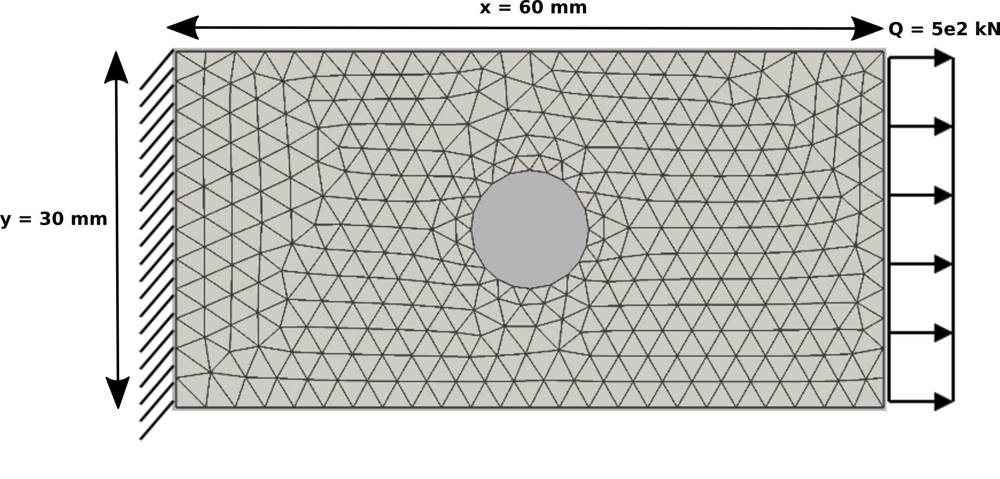
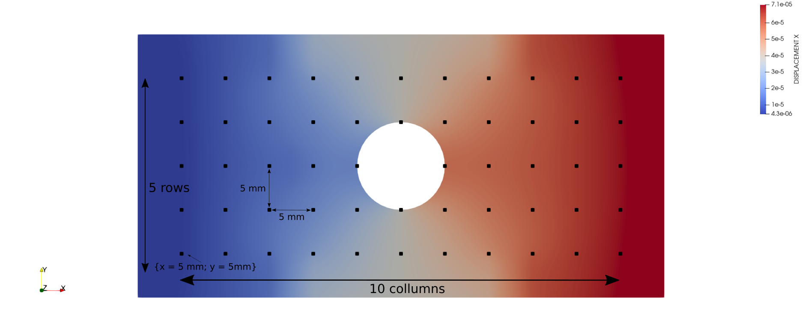

# Benchmarks: Verification Cases

**Author:** Ihar Antonau

**Kratos version:** 10.4.1

## Benchmarks Specification

This benchmark suit contains five scenarios to test damage localizations in structures. All examples are based on 2D Plate with a hole. The source file to prepare model can be find in /prep_mdpa folder. Each scenario folder contains three folders:
 - /damaged_system: simple FE run to compute displacements and strains of the damaged model. One can modify the damage intensity or position by choosing different sub mesh in Material.JSON file. The CAD and mesh is generated using SALOME, see plate_w_hole.hdf file.
  - /sensor_placement contains sensor_data.json to describe the sensor set to use in damage identification process.
  - /system_identification contains all file to run SI process. Here you can change all optimization settings or redefine optimization problem.

Figure below schematically describes the FE-model of the benchmark. The 2D plate is clamped at the left edge, and a distributed force is applied on the right side ($Q = 5\times10^{2}$ kN). The force has been chosen to keep the displacements relatively small for linear modeling. We are using 3D shell elements.  

To generate synthetic measurement data, the finite element model is first
evaluated in a damaged configuration by assigning reduced material proper-
ties to the predefined damage zones. The resulting displacement (or strain)
fields are then sampled at designated virtual sensor locations and stored
as the measured response. Because the ability to identify damaged regions
is highly sensitive to sensor placement, a uniform 5 mm sensor grid is em-
ployed to simplify the benchmark and mitigate sensor-location effects, see Figure below. This results in a total of 55 sensors, providing sufficient spatial coverage
to detect most damage zones located within the grid.

